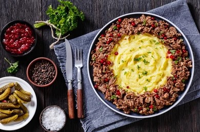
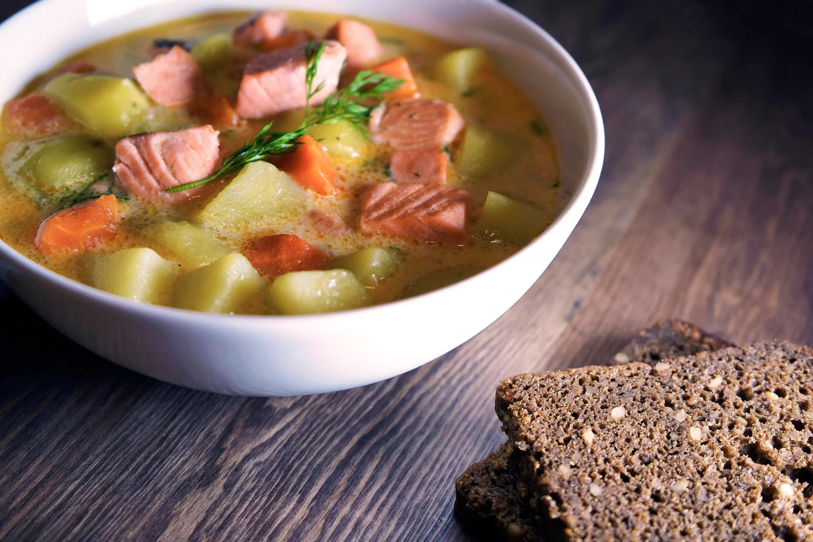
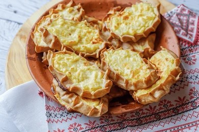

# Taste of Oulu

  

## Welcome to Taste of Oulu

Explore traditional Finnish cuisine made with fresh, local ingredients. 

---

## Menu

**[Home](#)** | **[About Us](#)** | **[Menu](#)** | **[Contact](#)**

---

### Our Specialties

  
   
  **Reindeer Stew**  
  A hearty, flavorful stew made with tender reindeer meat.  
  **Price:** 16.00 €

  
   
  **Salmon Soup**  
  A traditional creamy salmon soup that's perfect for cold days.  
  **Price:** 12.00 €

  
   
  **Karelian Pasty**  
  A savory pie filled with rice porridge, served with egg butter.  
  **Price:** 8.00 €

---

## About Us

At Taste of Oulu, we pride ourselves on serving authentic Finnish dishes with a modern twist. Our cozy atmosphere and dedicated staff will ensure you have a memorable dining experience.

---

## Opening Hours

**Monday - Friday:** 11:00 AM - 9:00 PM  
**Saturday:** 12:00 PM - 10:00 PM  
**Sunday:** Closed

---

## Contact Us

For reservations and inquiries, please email us at: [info@tasteofoulu.com](mailto:info@tasteofoulu.com)

---

*Follow us on social media for updates and special offers!*
